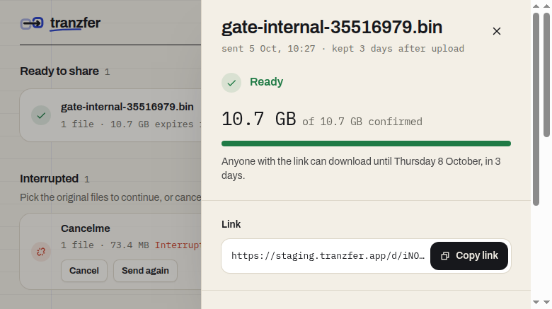
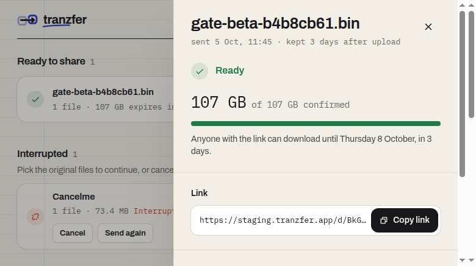

# Benchmarks

Measured transfer numbers from release-gate runs, with the raw evidence next to them. Gate rules and what each gate must prove are in [RELIABILITY.md](RELIABILITY.md#release-gates). Add a row when a gate run changes a number here, and put its evidence in `docs/benchmarks/<date>-<gate>-<size>/`.

All throughput is MiB/s (2^20 bytes per second). Run reports before this file said "MB/s" for the same numbers; the label was wrong and is fixed in the gate runner.

## Where the numbers come from

Every run is one `vp run test:gate` against https://staging.tranzfer.app:

- Machine: AMD EPYC 9J14, 31 GB RAM, Chromium driven over CDP from the same host.
- Source: a synthetic file served through FUSE (`e2e/tools/synthfile.py`), so disk speed doesn't cap the upload.
- Parts: 64 MiB each.
- App code: d1e192e for the two passing runs. Everything merged after it touched only `e2e/` and docs, so production (c221dda, #76) runs the same uploader.

Each evidence folder holds:

- `result.json`: the run report. It has the timeline, fault firings, ledger summary, hashes, durations and manual steps.
- `ledger.jsonl.gz`: every create, part, list and complete request the browser sent to R2, with its status. It has no signed URLs.
- Screenshots taken at each fault, at Ready and after verification.

## Results

| Run                                                                             | Uploader         | Size    | Upload, end to end  | Upload, best 60 s | Download   | Avoidable bytes | Result               |
| ------------------------------------------------------------------------------- | ---------------- | ------- | ------------------- | ----------------- | ---------- | --------------- | -------------------- |
| [10 GiB internal, 2026-10-03](benchmarks/2026-10-03-internal-10gib-sequential/) | 1 part at a time | 10 GiB  | 14.8 MiB/s, 694 s   | 26.7 MiB/s        | 74.6 MiB/s | 0               | speed baseline only  |
| [10 GiB internal, 2026-10-05](benchmarks/2026-10-05-internal-10gib/)            | 4 parts at once  | 10 GiB  | 43.1 MiB/s, 237 s   | 83.2 MiB/s        | 66.2 MiB/s | 0               | internal gate passed |
| [100 GiB beta, 2026-10-05](benchmarks/2026-10-05-beta-100gib/)                  | 4 parts at once  | 100 GiB | 30.6 MiB/s, 3,351 s | 88.5 MiB/s        | 59.7 MiB/s | 0               | beta gate passed     |

- End to end runs from Send to Ready and includes every fault, freeze and re-pick.
- Best 60 s is the most part acknowledgements in any 60-second window of the ledger, times 64 MiB.
- Download is one ranged GET of the whole object, which the runner resumes with `Range` if R2 drops the connection (#74).
- Avoidable bytes are bytes of any part R2 acknowledged twice.

The 2026-10-03 run doesn't count as gate evidence. Its failPart trap never fired, and #71 and #73 rebuilt fault injection after that. It stays here because it's the last run with Uppy's default of one part at a time. Four parts at once (#72) took the same fault plan from 14.8 to 43.1 MiB/s. Chromium allows 6 connections per origin, and R2's S3 endpoint speaks HTTP/1.1 only, so each part in flight needs its own connection.

## 10 GiB internal gate, 2026-10-05

Faults: offline for 90 s at 20%, then R2 rejected part 61 through a forged signature at 35%. A reload came at 50%. The Complete response was lost after R2 returned 200.

| Segment (parts acked)                   | Time  | Parts | Throughput |
| --------------------------------------- | ----- | ----- | ---------- |
| Send → offline (0 → 32)                 | 27 s  | 32    | 74.8 MiB/s |
| offline → failPart (32 → 56)            | 111 s | 24    | 13.8 MiB/s |
| failPart → reload (56 → 80)             | 23 s  | 24    | 67.9 MiB/s |
| reload → Complete trap armed (80 → 150) | 67 s  | 70    | 66.6 MiB/s |
| trap armed → Ready (150 → 158)          | 8 s   | 8     | 63.2 MiB/s |

Each segment starts at a fault and includes its recovery. The Complete trap is armed near the end and fires when the browser sends Complete. The offline segment is slow because 90 s of it had no network.

- Correctness: one upload id, 160 parts, `missing: []`, `avoidable: []`. The sha256 of the download matched the source (`cdbb991d…cf13`).
- Manual steps: one file pick after the reload. Re-pick verification took 17.3 s at 50%.
- Ready screen: 

## 100 GiB serious beta gate, 2026-10-05

Faults:

- offline for 90 s at 10%
- R2 rejected part 325 at 20%
- a reload at 25%
- the tab closed at 40%
- a 20-minute freeze at 50%, longer than the 15-minute `UPLOAD_URL_TTL`, so signed part URLs expired
- a browser crash and relaunch at 60%
- at 70%, a different file with the same name and size, which the app rejected before the real one was picked
- the Complete response lost after R2 returned 200

| Segment (parts acked)                          | Time    | Parts | Throughput |
| ---------------------------------------------- | ------- | ----- | ---------- |
| Send → offline (0 → 160)                       | 138 s   | 160   | 74.0 MiB/s |
| offline → failPart (160 → 320)                 | 221 s   | 160   | 46.3 MiB/s |
| failPart → reload (320 → 400)                  | 68 s    | 80    | 75.2 MiB/s |
| reload → close tab (400 → 640)                 | 286 s   | 240   | 53.7 MiB/s |
| close tab → freeze (640 → 800)                 | 287 s   | 160   | 35.7 MiB/s |
| freeze → crash (800 → 960)                     | 1,372 s | 160   | 7.5 MiB/s  |
| crash → impostor (960 → 1,120)                 | 341 s   | 160   | 30.0 MiB/s |
| impostor → Complete trap armed (1,120 → 1,590) | 615 s   | 470   | 48.9 MiB/s |
| trap armed → Ready (1,590 → 1,598)             | 21 s    | 8     | 24.5 MiB/s |

Without the 20-minute freeze the whole upload averages 47.6 MiB/s. A clean stretch runs at 74 to 75 MiB/s. The app's own progress showed 108 MB/s at the start of the freeze segment (`06-fault-sleep.png`), but that is an instantaneous browser estimate, not a measured number.

- Correctness: one upload id, 1,600 parts, `missing: []`, `avoidable: []`. The sha256 matched (`71dc6dcf…2c04`). The ledger counts 1,598 acked parts because two parts landed in R2 while their responses were cut off by faults. R2 had them anyway: Complete went through with all 1,600 parts and the hash matched.
- Sends with no response: 39. Each one was a part in flight when a fault hit. None of those parts was acked twice.
- Manual steps: exactly the 5 planned picks. They came after the reload, the closed tab and the crash, then the changed file, then the real file after the impostor.
- Download: R2 dropped the single GET at 39.2 GB and at 77.4 GB. Both times the runner resumed with `Range` and finished at 59.7 MiB/s.
- Ready screen: 

## Re-pick verification

After a re-pick, the app lists the parts R2 holds and MD5s each one from the local file before it uploads anything new. The time runs from the pick to the first new part PUT.

| Gate    | Picked at      | Parts held | Time    | Rate      |
| ------- | -------------- | ---------- | ------- | --------- |
| 10 GiB  | reload, 50%    | 80         | 17.3 s  | 296 MiB/s |
| 100 GiB | reload, 25%    | 400        | 82.2 s  | 311 MiB/s |
| 100 GiB | close tab, 40% | 640        | 131.4 s | 312 MiB/s |
| 100 GiB | crash, 60%     | 960        | 195.9 s | 314 MiB/s |
| 100 GiB | impostor, 70%  | 1,120      | 227.9 s | 315 MiB/s |

The rate is flat, so the time grows with progress. Hashing runs one part at a time. At the 350 GiB gate's 85% re-pick that is about 16 minutes before the upload moves, and fixing it comes before that gate ([plan](plan/01-foundation.md)). These numbers come from the FUSE source; a real SSD or a USB drive will differ.

## Reproduce a number

```sh
# end to end, from result.json
jq '.recorded | {uploadSeconds, uploadThroughput, downloadThroughput, verifyDurationsMs}' docs/benchmarks/2026-10-05-beta-100gib/result.json

# per segment: parts acked between timeline events × 64 MiB / elapsed
jq -r '.timeline | [.[:-1], .[1:]] | transpose[] | "\(.[0].name) → \(.[1].name): \((.[1].partsAcked - .[0].partsAcked) * 64 / ((.[1].at - .[0].at) / 1000) * 100 | round / 100) MiB/s"' docs/benchmarks/2026-10-05-beta-100gib/result.json
```
