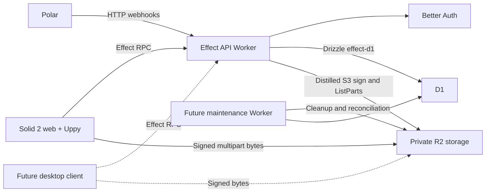

# STACK.md

# Tranzfer v2 stack

Architecture selected on 2026-09-14: Effect 4, Effect RPC, and Effect Schema.
[Issue #7](https://github.com/darjss/tranzfer-v2/issues/7) records the decision.
[The readiness plan](plan/02-pre-upload-readiness.md) tracks implementation.
This document describes the target architecture. The installed-version section
records the current packages, including libraries awaiting removal.

This document describes the intentionally small technical stack for Tranzfer v2.

The goal is not to maximize the number of good libraries we use.

The goal is to have **one obvious tool for each job** and a codebase that humans and coding agents can understand without archaeological excavation.

The stack is allowed to contain powerful tools.

It is not allowed to become a museum of interesting tools.

---

# Runtime and workspace

## Package manager

**pnpm** is the lockfile and workspace. **Vite+** (`vp`) is how humans and
agents run commands. `vp install` / `vp add` still drive pnpm. `vp check` and
`vp run` are the day-to-day surface. Do not document a parallel `pnpm run`
habit.

```text
apps/*
infra
packages/*
```

Why:

- mature monorepo behavior
- deterministic installs
- workspace protocol
- dependency catalogs
- already proven in Store Kit
- boring in a good way

Do not introduce Turborepo/Nx unless the repository eventually demonstrates an actual need for them.

The monorepo is small enough that package-manager workspaces are sufficient.

## Local addresses

Use **Portless** for named local URLs. From the repo root:

```text
vp run dev
```

That runs `alchemy dev` from `infra/alchemy.run.ts` behind Portless, so the same stack owns bindings in dev and production. Alchemy serves local workerd with D1/R2 simulators under `infra/.alchemy/local` (stage `dev_$USER`, logs under `infra/.alchemy/log/<stage>/`). Addresses:

```text
https://tranzfer.localhost       apps/web (:3000)
https://api.tranzfer.localhost   apps/api (:8787, via `portless alias api.tranzfer 8787`)
```

The proxy serves TLS; use `curl -k`. Do not hard-code `localhost:3000` in docs or scripts.

One `portless.json` at the repo root names the single `tranzfer` app. `turbo` is off; this repo does not use Turborepo.

Everyday local serving is `vp run dev` (Portless). `vp dev` skips the proxy and lands on 3000 or the next free 3001–3003. Agents must open `https://tranzfer.localhost`, not those ports. See `.agents/skills/portless/SKILL.md`.

---

# Repository shape

```text
tranzfer/
├── apps/
│   ├── web/
│   ├── api/
│   └── maintenance/
│
├── packages/
│   ├── contracts/
│   ├── db/
│   └── upload-core/
│
├── infra/
│
├── SOUL.md
├── VISION.md
├── STACK.md
├── AGENTS.md
├── package.json
└── pnpm-workspace.yaml
```

That is the starting point.

A future desktop client may eventually add:

```text
apps/desktop/
```

but **do not create it before recurring real-world usage justifies it**.

When it exists, it should reuse contracts and transfer behavior instead of importing website implementation code.

Do not create:

```text
packages/common
packages/shared
packages/utils
packages/helpers
packages/core
```

as dumping grounds.

New packages require a real architectural boundary.

---

# Frontend

## Solid 2

**Solid 2** is the application framework.

Pin the exact Solid 2 release used by the repository.

Do not use floating prerelease ranges.

No React compatibility layer.

No React component dependencies.

No Astro.

No SolidStart.

Do not introduce a separate metaframework unless the product eventually proves one is necessary.

The web application is a Solid application.

Solid should be written as Solid rather than React with different syntax.

Use Solid's reactive model directly and keep state close to the feature that owns it.

---

## Vite+

Use **Vite+** (`vp`) and **Vite** for the web application.

Keep the build setup boring. `filesystem-routing`, `@solidjs/meta`, and
`prerender-crawler` are the site wiring. That is not SolidStart.

The web Worker is the production server. `@cloudflare/vite-plugin` owns the `ssr` Vite environment (`viteEnvironment: { name: "ssr" }`) so `vp dev` / `vp build` / `vp preview` run the Solid `handleRequest` export inside workerd. The Solid handler is the Worker entry; there is no custom entry module (the Solid plugin owns the `ssr` build input). Server routes are uppercase handler exports in `src/routes/*.ts`, dispatched by `src/middleware.ts`; they reach bindings through a lazy `import("cloudflare:workers")`. There is no Node `server.js`.

Client assets are Workers static assets (assets-first: hashed files never hit the Worker). HTML, server functions, and the demo `/api/*` filesystem routes go through the Worker. Canonical product operations belong on the dedicated API Worker through Effect RPC.

Environment validation uses T3 Env with Effect Schema. Separate public build-time values from Worker runtime secrets and typed service bindings. Validate only configuration the app actually needs.

Do not introduce framework layers just to gain conventions that Tranzfer does not need.

---

## Routing

Use the official **Solid Router 2** line compatible with the pinned Solid 2 release.

The router owns navigation.

It does not own the domain, data layer, or API contract.

---

## Tailwind CSS

Use **Tailwind CSS v4** for styling.

Keep design tokens and global primitives small and deliberate.

Avoid giant component abstraction systems.

Create reusable components when reuse is real.

---

## Class names

Use **cva** (`cva` 1.x, not `class-variance-authority`) and **cnfast** for
variant classes and `cn()`. They already replaced v1's `clsx` + `tailwind-merge`

- CVA. Pin exact versions. Do not add those three packages back.

---

## UI primitives

Prefer native HTML first.

Use **Kobalte 2** selectively for accessibility-heavy interactive primitives where implementing correct behavior ourselves would be stupid.

Good examples:

```text
dialog
popover
tooltip
select
combobox
dropdown menu
tabs
```

Pin the exact Kobalte version.

Wrap unstable headless primitives behind small local UI components so library churn does not spread across the application.

Do not use Kobalte for things that are already trivial HTML:

```text
button
input
card
layout container
```

Do not install a second headless UI ecosystem unless a concrete missing primitive justifies it.

No Corvu for now.

No React UI ecosystem.

Do not reproduce the dependency soup from Tranzfer v1.

---

## Icons

Chrome icons are **Phosphor Bold** outlines, `currentColor`, one family.
Wire them with `unplugin-icons` and `@iconify-json/ph` so Vite tree-shakes
glyphs. Do not install `solid-icons` (it ships every pack, including Lucide).

Match Archivo semibold and the landing's round 2.2–2.8 strokes. Regular and
thin weights look broken next to the CTAs. Duotone is allowed only for empty
or hero moments, tinted with `--color-blue` and `--color-ink`. Keep the brand
mark, word underline, asterisks, and notebook scribbles as the custom SVGs they
already are.

Do not use Lucide, Tabler, Heroicons, Iconoir, Remix Icon, Material Symbols, or
MingCute for product chrome.

---

## Solid Primitives

Use **Solid Primitives** à la carte when a primitive clearly saves real implementation work.

Potentially useful examples include:

```text
connectivity
scheduled
storage
event-listener
resize-observer
virtual
```

Do not install primitives speculatively.

Do not let a utility primitive become the owner of transfer state.

Upload mechanics remain Uppy's responsibility.

---

## Forms

Use **TanStack Form** with **Effect Schema**, once the Solid 2 adapter and schema integration are verified.

Forms are generic state machines that we do not need to hand-roll.

TanStack Form owns:

```text
field state
touched / dirty state
validation lifecycle
submit state
form errors
field errors
reset/default values
async validation when needed
```

Effect Schema owns runtime validation schemas.

Do not build a parallel internal form framework.

Small local field wrappers for consistent labels, descriptions, and errors are fine.

Do not create a giant abstraction layer over TanStack Form.

---

## Remote data

Do **not** add TanStack Query initially.

Use Solid 2's native async/reactive primitives and the typed Effect RPC client. Keep Solid responsible for UI state; do not add Effect Atom.

Tranzfer does not currently need a second client-side cache system with query keys, invalidation policy, garbage collection, and hydration machinery.

If real product behavior later demonstrates a need for advanced shared remote caching, reconsider it then.

---

## Tables

Do **not** add TanStack Table initially.

Render ordinary transfer lists and simple tables directly with Solid.

Introduce a table library only if the product genuinely grows into complex sorting/filtering/resizing/pinning/virtualized table behavior.

---

## Matching

Use Effect for exhaustive matching. `Data.TaggedEnum` for internal state
machines, `Schema.TaggedUnion` plus `.match` for boundary-crossing unions, and
`Match` for literal branching in Effect code. Upload-core tagged states belong
here, not a second matcher.

Do not turn every boolean into a tagged union for sport.

---

# Validation and contracts

## Effect Schema

Use **Effect Schema** for RPC inputs, success values, expected errors, form
validation, and serialized boundary data. Infer TypeScript types from schemas
rather than maintaining parallel DTOs. Validate network data at runtime.

Use `@t3-oss/env-core` 0.13.11 with Effect Schema Standard Schema values in
`apps/web/env.ts` and `apps/api/src/env.ts`. Bindings stay typed on
`Cloudflare.Env` via each app's `worker-env.d.ts`.
Do not retain a second schema system.

---

## packages/contracts

Shared contracts contain only things that genuinely cross boundaries.

Examples:

```text
transfer DTOs
delivery DTOs
device DTOs
billing-plan identifiers
serialized result shapes
public API request/response models
shared domain enums/unions
Effect schemas and RPC operation contracts
```

`packages/contracts` must not import:

```text
API handler implementations
Drizzle
Cloudflare bindings
application handlers
UI code
```

Effect RPC handlers and clients consume the same operation contracts.

Contracts may import Effect Schema and RPC declarations. They must not import
server handlers, service implementations, or database details.

Prefer plain TypeScript where runtime validation is unnecessary.

Do not create parallel copies of the same model in web/api/database packages.

Contracts must not import database implementation details.

---

# Upload engine

## Uppy Core

Use:

```text
@uppy/core
@uppy/aws-s3
@uppy/drop-target
```

Uppy owns browser-side upload mechanics.

We own the UI.

Do **not** use Uppy Dashboard as the product UI.

Build the Solid interface ourselves and bridge Uppy events into Solid state.

Do not split upload ownership between Uppy and a second dropzone/file-upload framework.

---

## Direct client → R2

Actual file bytes should normally travel:

```text
Web / future Desktop
        │
        └──────────────→ Cloudflare R2
            signed upload
```

Not:

```text
Client → Worker → R2
```

Workers are the control plane.

R2 is the data plane.

The API authenticates the user, authorizes the operation, owns transfer metadata, and signs storage operations.

The Worker should never proxy hundreds of gigabytes unnecessarily.

---

## Multipart uploads

Large files use R2's S3-compatible multipart API through Uppy.

The upload implementation must support:

- multipart upload creation
- dynamic chunk sizing
- lazy signing
- retries with backoff
- `ListParts`
- resume reconciliation
- multipart completion
- abort
- persisted upload identity
- progress
- throughput
- ETA
- refresh recovery
- network interruption recovery

Chunk sizing must respect the 10,000-part limit.

Do not return to the v1 pattern of hard-coded 25 MB pieces and pre-signing every URL at the beginning.

Local file identity uses the platform: slice the `File` and hash with Web Crypto.
Do not load hundreds of gigabytes into RAM and do not add `spark-md5`. If Web
Crypto streaming is too slow on huge cards, `hash-wasm` is the allowed extra.
Magic-byte allowlisting may use `file-type` when that gate ships. Turnstile is
the abuse widget (siteverify over `fetch`); do not add a second captcha SDK.
The global `turnstile-spin` skill is the setup path when that work starts.

---

## packages/upload-core

`packages/upload-core` contains transfer behavior that should not care about Solid.

It owns concepts such as:

```text
UploadSession
UploadState
UploadProgress
MultipartPlan
RetryPolicy
UploadError
```

It must not import:

```text
solid-js
API handler implementations
Drizzle
Cloudflare bindings
UI components
```

Browser-specific behavior belongs in `apps/web`.

The reason this boundary exists is simple:

A future desktop client should be able to reuse the transfer model without importing the website.

Do not invent plugin systems or transport abstractions before they are needed.

---

# API

## Effect 4 and RPC

Use **Effect 4** for application workflows and **Effect RPC** for first-party
web-to-API operations. The dedicated Cloudflare API Worker owns the server.
Solid remains the UI/reactivity system. Uppy remains the multipart transport.

Define each operation's input, success, and expected-error schemas once in
`packages/contracts`. Implement handlers against that contract and derive the
client from it. Do not duplicate request/response types or cast network replies.
Keep contracts free of server-only implementations and secrets.

RPC coordinates creation, authorization, signing, recovery, and finalization.
File bytes travel directly between the client and R2, never through RPC.
Keep ordinary HTTP endpoints for Better Auth, Polar webhooks, health checks, and
browser download links. Do not introduce another RPC framework.

The API Worker runs on **effect-cf** `Worker.make`. Effect RPC sits on `POST
/rpc` via `RpcServer.toHttpEffect`; web reaches it through the `API` service
binding. Do not use effect-cf `rpc:`; that is Cloudflare Workers RPC, a
different mechanism.

Talk to R2 with **Distilled S3** (`@distilled.cloud/aws`) against the R2 S3
endpoint. Do not wrap `env.BUCKET` with effect-cf `R2.Tag`.

Contract validation and inferred client types do not prove authorization,
idempotency, or persistence correctness; handlers must enforce those
requirements explicitly.

## Workflows and dependencies

Use `Effect.gen` or `Effect.fn` for meaningful application workflows. Use
services and Layers at external boundaries such as persistence, storage, and
authentication. Keep pure calculations as ordinary functions. Do not create a
service for every helper or a parallel dependency-injection framework.

Run Effects at application entry points. Keep runtime calls out of domain
functions. Use bounded concurrency and retry policies where application code
owns the operation. Uppy still owns part-upload concurrency and retry behavior;
do not wrap it in another retry loop or Stream solely for consistency.

Fibers, runtimes, and scopes are process-local. Durable metadata in D1 and
IndexedDB reconstructs work after process loss. R2 remains authoritative for
uploaded parts. A disposed component or interrupted fiber must never implicitly
abort a remote multipart upload. Explicit authorized cancellation owns that
operation. Finalizers release process resources, not durable transfers.

Pin compatible Effect 4 versions and verify the Worker and Solid integrations.
The RPC modules are under `effect/unstable`; accept and manage that upgrade cost.
The official Solid example uses Effect 3, so adapt it against installed APIs and
preserve typed service requirements without `any`. Do not add an Atom state layer.

---

# Expected errors

Use Effect's typed error channel for expected domain failures. Define tagged
errors for distinct handling decisions such as authorization expiry, missing
file access, file mismatch, expired multipart state, and quota exhaustion.
Serialize public failures through the RPC error schemas. Keep internal defects
and secret details out of client responses.

Retry only failures whose operation is safe to repeat. Reconcile uncertain
completion against remote truth before retrying destructive or finalizing work.
Unexpected programmer defects remain defects; do not disguise every exception
as an expected business failure.

Keep one application error model rather than wrapping Effects in a second
Result abstraction.

---

# Database

## Cloudflare D1

Use **Cloudflare D1** for relational application state.

D1 stores metadata.

R2 stores files.

Never store large file payloads in D1.

---

## Drizzle ORM

Use **Drizzle ORM v1 RC** (`drizzle-orm@1.0.0-rc.4` when researched) with D1
through `drizzle-orm/effect-d1` and `@effect/sql-d1`. Provide `D1Client` from
the Worker binding (`effect-cf` `D1.sqlLayer`). Official Effect examples are
Postgres (`drizzle-orm/effect-postgres`); D1's Effect driver shipped in rc.4.
Stay on one query API. Do not keep Promise-based `drizzle-orm/d1` beside it.

Drizzle owns:

- schema definitions
- migrations
- typed queries
- relational persistence

`packages/db` owns database details.

The rest of the application should not scatter raw SQL and table imports everywhere.

Prefer explicit queries over giant repository abstraction layers.

Do not create `BaseRepository<T>`.

Do not build an ORM on top of the ORM.

---

## IDs

Use standard generated identifiers unless the product demonstrates a reason for something more exotic.

Prefer platform primitives such as:

```ts
crypto.randomUUID();
```

No TypeID. No `@paralleldrive/cuid2`. No nanoid unless UUID is proven wrong.

In Effect workflows use **Effect DateTime**. At non-Effect edges use `Date` or
`Temporal`. No `date-fns`, Luxon, or Dayjs.

Outgoing HTTP in Effect code uses Effect `FetchHttpClient` and Distilled S3.
Polar's SDK talks to Polar. No `ky`, `ofetch`, `axios`, or a default `aws4fetch`
dependency. If Distilled path-style presign fails against R2, Distilled still
owns ListParts and `aws4fetch` is the documented signing fallback.

Log at Worker and CLI entry with Effect's logger. No Axiom, Sentry, or a second
telemetry SDK until a transfer-reliability need names one.

Browser durable session metadata uses IndexedDB through the platform API. No
Dexie or `idb` until the platform API is actually the problem.

---

# Authentication

## Better Auth

Use **Better Auth**.

Keep authentication centralized in the API boundary.

Google OAuth is the initial sign-in path.

Authentication and authorization are different concerns.

Better Auth establishes identity.

Tranzfer decides whether that identity can:

```text
create a transfer
view a transfer
manage a workspace
extend retention
access billing
download private content
```

Do not scatter authorization logic through UI components.

---

# Billing

## Polar

Use **Polar** as Merchant of Record.

Polar owns:

- checkout
- subscription billing
- international payment handling
- customer-side sales tax / VAT handling
- subscription lifecycle events

Tranzfer owns:

- entitlement state
- feature access
- plan limits
- reconciliation with Polar webhooks

Initial product tiers:

```text
Free
Pro
Studio
Enterprise
```

The product meaning is roughly:

```text
Free       prove Tranzfer works
Pro        move huge files reliably
Studio     run a recurring production workflow
Enterprise negotiated security/admin/compliance needs
```

Do not encode pricing assumptions deep into business logic.

Use stable internal plan identifiers and map external Polar product IDs through configuration.

Do not turn the pricing model into a matrix of tiny add-ons before customers demand it.

Keep Polar off the browser bundle. Checkout glue may use `@polar-sh/better-auth`
on the API if that plugin stays Cloudflare-compatible. Entitlements stay in
D1, reconciled from webhooks.

---

# Transfer security and abuse

R2 transfer objects are private.

Download access is mediated by transfer state and authorization.

Initial product constraints:

- Google OAuth through Better Auth
- Turnstile on abuse-sensitive entry points
- production-media / creative-file allowlist
- no archives
- no executables
- validate actual file signatures rather than trusting extensions alone
- short default retention
- download-fanout anomaly detection
- abuse-report path
- admin transfer disable/delete controls

Tranzfer is delivery infrastructure, not public file hosting.

Do not build a giant moderation platform before real abuse requires it.

---

# Cloudflare

Cloudflare is the deployment platform.

Use:

```text
Workers
D1
R2
Queues where materially useful
KV where genuinely appropriate
Cron / scheduled Workers
Service Bindings
Turnstile
```

---

## apps/api

Dedicated Effect RPC API Worker, with HTTP endpoints for auth, webhooks, health, and downloads.

Responsibilities include:

```text
auth
transfer lifecycle
multipart signing
download authorization
deliveries / inbox
billing/webhooks
workspace operations
future device registration
```

The API is a modular monolith.

Do not split auth, transfers, billing, inbox, and devices into separate services just because they could be separate Workers.

---

## apps/maintenance

Small scheduled/queue consumer Worker for asynchronous maintenance.

Examples:

```text
expire transfers
delete expired R2 objects
abort stale multipart uploads
reconcile stale database state
process lightweight asynchronous inspection jobs
```

Do not turn this into a generic job framework.

---

## R2

Use **R2 Standard storage** for transfer payloads.

Files are temporary.

Default product behavior should encourage short retention.

Uploads and downloads should normally bypass Worker compute and communicate directly with R2 using scoped signed operations.

---

## Queues

Use **Cloudflare Queues** when asynchronous work genuinely benefits from decoupling.

Examples may include:

```text
R2 event follow-up
lightweight media inspection
moderation pipeline triggers
cleanup/reconciliation work
notification fanout
```

Do not use Queues merely because event-driven architecture sounds sophisticated.

---

## KV

KV is optional.

Only use it for workloads that fit KV semantics:

```text
short-lived cache
rate-limit metadata
small globally-read configuration
```

Do not use KV as a relational database.

---

# Infrastructure

## Alchemy v2

Use **Alchemy v2** to define Cloudflare infrastructure in TypeScript.

Pin the exact Alchemy v2 version. Current pin: `alchemy@2.0.0-beta.77`.

Alchemy v2's stack file is an Effect program. Application code also uses Effect 4. Keep Alchemy's pinned requirements separate from application version selection. Review workspace-wide overrides during migration and do not pass version-specific Effect objects between incompatible runtimes.

Alchemy is the authoritative source of Cloudflare infrastructure state. Local development runs through `alchemy dev` on the same stack, which simulates D1 and R2 locally; there are no app Wrangler configs.

The `tranzfer` stack in `infra/alchemy.run.ts` currently creates:

```text
D1 database App
R2 bucket Files (private)
API Worker tranzfer-api (D1 + R2 bindings)
web Worker tranzfer-web (service binding API, custom domain tranzfer.app)
workers.dev URLs
```

Queues, KV, scheduled triggers, and R2 CORS wait until a product path needs them.

Do not maintain overlapping infrastructure truth in Wrangler configuration.

Wrangler may still be used for:

```text
local debugging
diagnostics
manual inspection
emergency operations
```

but it is not a second infrastructure-management system.

Before applying infrastructure changes:

1. typecheck
2. run the Alchemy plan
3. inspect creates/replacements/deletions
4. do not apply destructive replacements casually

Do not casually rename stable Alchemy resource IDs.

Keep infrastructure readable.

Do not create a generalized internal cloud platform.

---

# Tooling

## TypeScript

Strict TypeScript.

Avoid `any`.

Avoid type gymnastics whose only achievement is impressing TypeScript.

Types exist to make changes safer and behavior easier to understand.

---

## oxlint

Use **Oxlint through Vite+** with `ultracite/oxlint/core`, followed by
`ultracite/oxlint/anti-slop`. Use `eslint-plugin-solid/configs/v2-strict`
for Solid code. Keep type-aware checks enabled and promote reactivity diagnostics
to errors. Lint local UI components; do not exclude entire UI folders.

On Effect packages, add official `@effect/tsgo` `correctness` and `antipattern`
presets only. Do not enable the full `recommended` or `effect-native` presets
on the web app. Do not add a second ESLint plugin for Effect.

Root and web `vp lint` share `lint.config.ts`. The `prepare` script runs
`vp config` and `effect-tsgo patch --no-typescript --oxlint` so Oxlint 1.82.0 and
`oxlint-tsgolint` 7.0.2001 match `@effect/tsgo` 0.45.0. Type-aware rules and
full `typeCheck` are on: `vp check` and `vp lint` typecheck every workspace
tsconfig through tsgolint on the TypeScript Go toolchain. `vite.config.ts` may
assert the lint object: Vite+ types OxlintConfig from oxlint 1.81 while the
workspace pins 1.82.0 for `@effect/tsgo`.

Fast feedback matters heavily in an agent-driven repository.

Lint and type violations should fail CI.

---

## oxfmt

Use **oxfmt** for formatting.

One formatter.

One format.

No discussions.

---

# Testing

No Playwright initially.

The highest-value tests for Tranzfer are not screenshot tests.

Prioritize:

```text
upload-core state tests
multipart planning tests
retry behavior
result/error serialization
authorization tests
D1 integration tests
Worker/API integration tests
cleanup behavior
upload reconciliation
```

Use Cloudflare's Worker testing environment where real Worker/D1/R2 behavior matters.

The real product also requires **torture testing** that intentionally destroys uploads:

```text
10 GB
100 GB
350 GB

disconnect network
expire signed URL
refresh page
close page
sleep machine
restart router
fail multipart part
resume later
```

Those tests matter more than whether a login button is four pixels too far left.

Browser automation can be introduced later if it begins paying for itself.

---

# Things intentionally not in the stack

Do not add these without a concrete new requirement:

```text
React
Astro
Next.js
SolidStart

TypeBox
drizzle-typebox
TypeID
cuid2
nanoid
date-fns
Luxon
Dayjs
ky
ofetch
axios
Dexie
idb
clsx
tailwind-merge
class-variance-authority
Playwright

TanStack Query
TanStack Table

Corvu
Lucide
Tabler Icons
Heroicons
Iconoir
Remix Icon
solid-icons
additional UI ecosystems

oRPC
GraphQL

Redux
Zustand

Kafka
Redis

Turborepo
Nx

microservices
generic event buses
additional dependency injection frameworks
internal plugin architectures
```

TanStack Form is selected for form state management, pending compatible Solid 2 and Effect Schema integration.

"No microservices" means:

> Do not decompose the Tranzfer domain into independently owned network services without a demonstrated need.

The web Worker, API Worker, and maintenance/queue consumer are deployment boundaries, not permission to build a service mesh.

This list is not ideological.

It exists because every dependency and abstraction increases the amount of context a human or coding agent has to understand.

The repository should remain small enough to fit inside somebody's head.

---

# The architecture in one picture



The most important line in this entire document is:

> **Client → R2 for bytes. The API is the control plane.**

Everything else exists to make that transfer safe, resumable, understandable, and billable.

---

# Installed versions (foundation)

Current manifest snapshot. Bump versions deliberately.

| Package                                      | Where               | Version       |
| -------------------------------------------- | ------------------- | ------------- |
| solid-js, @solidjs/web, @solidjs/diagnostics | web                 | 2.0.0-rc.8    |
| @solidjs/router                              | web                 | 2.0.0-next.24 |
| @solidjs/vite-plugin                         | web                 | 3.0.0-next.43 |
| alchemy                                      | infra               | 2.0.0-beta.77 |
| effect                                       | web, api, contracts | 4.0.0-rc.115  |
| effect                                       | infra               | 4.0.0-rc.112  |
| effect-cf                                    | api                 | 0.44.1        |
| @distilled.cloud/aws                         | api                 | 1.0.0-rc.9    |
| @effect/sql-d1                               | api                 | 4.0.0-rc.115  |
| @t3-oss/env-core                             | web, api            | 0.13.11       |
| ultracite                                    | root                | 7.11.1        |
| @effect/tsgo                                 | root                | 0.45.0        |
| oxlint                                       | root, web           | 1.82.0        |
| oxlint-tsgolint                              | root                | 7.0.2001      |
| @cloudflare/vite-plugin                      | web                 | 1.54.8        |
| tailwindcss, @tailwindcss/vite               | web                 | 4.3.3         |
| @uppy/core                                   | web                 | 6.0.1         |
| @uppy/aws-s3                                 | web                 | 6.1.0         |
| @uppy/drop-target                            | web                 | 5.0.0         |
| cva                                          | web                 | 1.0.0-beta.8  |
| cnfast                                       | web                 | 0.2.0         |
| unplugin-icons                               | web                 | 24.0.0        |
| @iconify-json/ph                             | web                 | 1.2.2         |
| @kobalte/core                                | web                 | 2.0.0-alpha.2 |
| better-auth                                  | api                 | 1.7.4         |
| drizzle-orm                                  | api                 | 1.0.0-rc.4    |
| drizzle-kit                                  | api                 | 1.0.0-rc.4    |
| @polar-sh/sdk                                | api                 | 0.49.0        |
| portless                                     | root                | 0.15.6        |

## Pending implementation and compatibility

Kobalte `2.0.0-alpha.2` is installed and renders SSR under Solid rc.8, but its
peer range pins rc.3 exactly (`@kobalte/utils` wants rc.0), so installs warn.
That warning is a known mismatch, not a defect to silence with overrides; treat
it as accepted alpha risk and re-check it whenever Solid moves.

Phosphor Bold ships through `unplugin-icons` (`compiler: "solid"`) and
`@iconify-json/ph`. Import as `~icons/ph/<name>-bold`. unplugin-icons' bundled
Solid type shim predates Solid 2, so `apps/web/src/icons.d.ts` declares the
`~icons/*` modules against `@solidjs/web` JSX types instead.

TanStack Solid Form is not installed. Its store dependency requires Solid 1
and the 2.0 alpha cannot be imported under Solid 2. Re-check for a maintained
Solid 2 release before any form work; do not add it on peer-range syntax alone.

`drizzle-orm@1.0.0-rc.4` was built against `effect@4.0.0-beta.83`, which still
exported `Schema.TaggedErrorClass`. A `patchedDependencies` entry renames those
call sites to `Schema.TaggedError` for rc.115; drop the patch when a drizzle
release targets a current Effect RC.

`@distilled.cloud/aws` and `@distilled.cloud/core` are patched for the same
Effect RC drift; see `patches/`.

Better Auth stays on the API Worker. We do not use its Solid 1 UI adapter.

Effect is currently pinned to `4.0.0-rc.112` in infrastructure for
`alchemy@2.0.0-beta.77`. This describes the existing installation, not a
restriction against the selected Effect application architecture.

Solid Primitives for intersection observation, mouse input, and timers are
installed. Other primitives remain optional and require an actual use.

`packages/contracts` holds the shared Effect RPC group. `packages/db` and
`packages/upload-core` do not exist yet; create them when their first real
implementation needs those boundaries.

Ultracite core, its bundled anti-slop preset, Solid v2 strict, Effect
`correctness`/`antipattern` lint, and T3 Env are installed. CI/deployment
automation remains planned.

---

# Decision rule

When considering a new library, package, abstraction, service, or architectural layer, ask:

> Does this make the next 350 GB transfer more reliable, make the code materially easier to maintain, or help us acquire/serve paying customers?

If the answer is no:

**don't fucking add it.**
